# Hanouti Credit Manager

Hanouti Credit Manager is a Flutter mobile application built for store owners who need a simple, reliable way to track customer credit, purchases, payments, due dates, and business activity. The app stores data locally with SQLite and provides practical tools for daily credit management, customer follow-up, reporting, backup, and device-to-device synchronization.

Developer: Benallou Abdelaziz

## Overview

Small stores often manage customer credit manually, which can lead to missed payments, unclear balances, and poor follow-up. This application solves that problem with a structured mobile system for recording customers, managing debts, tracking payments, generating reports, and monitoring store performance.

The interface supports Arabic, French, and English, with right-to-left layout support for Arabic users.

## Screenshots

<table>
  <tr>
    <td>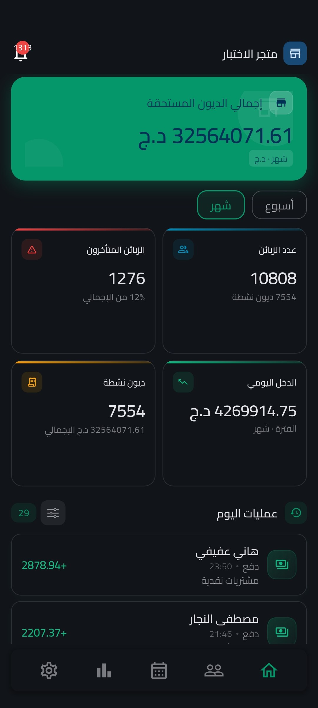</td>
    <td>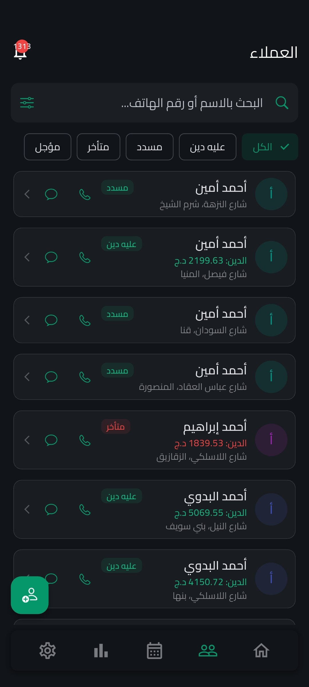</td>
    <td>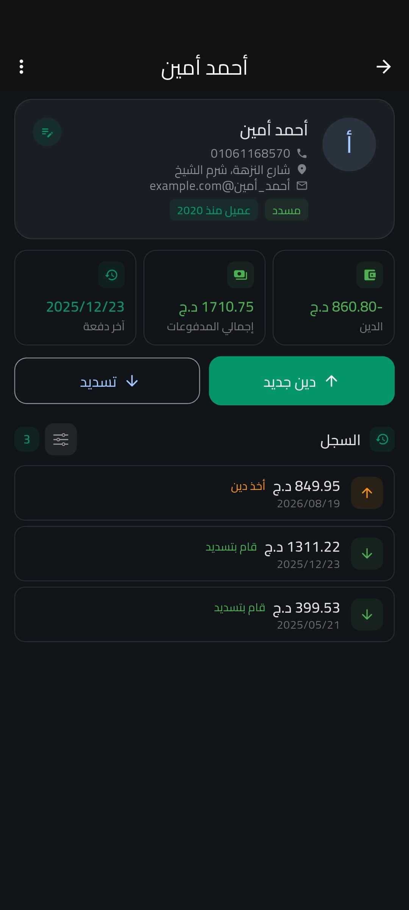</td>
  </tr>
  <tr>
    <td>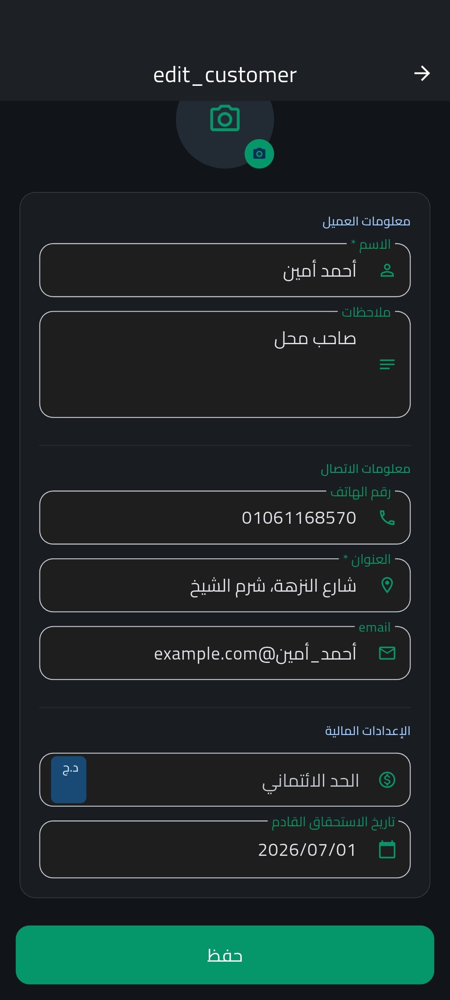</td>
    <td>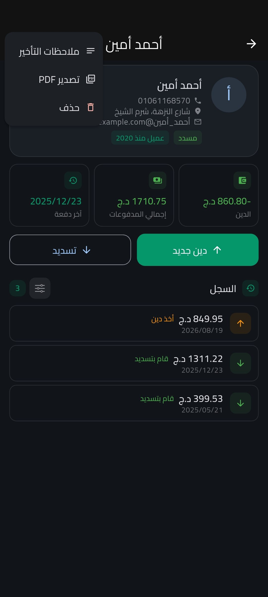</td>
    <td>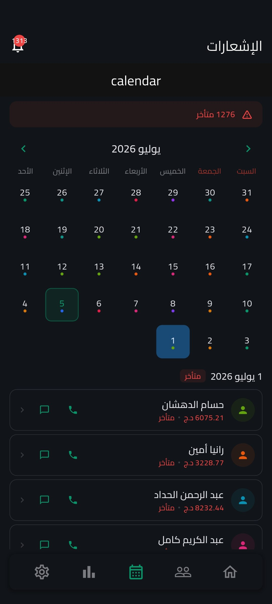</td>
  </tr>
  <tr>
    <td>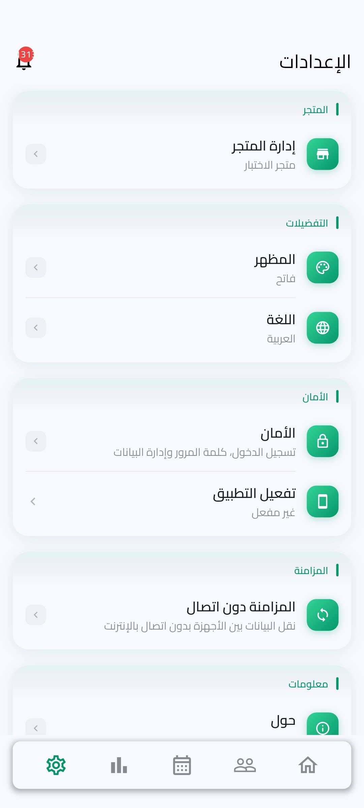</td>
    <td>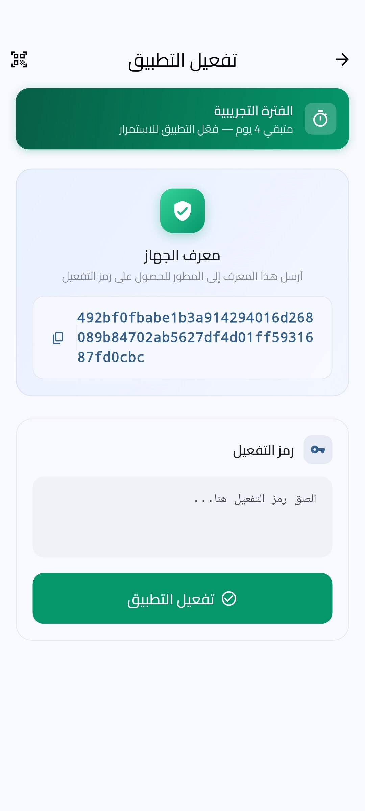</td>
    <td>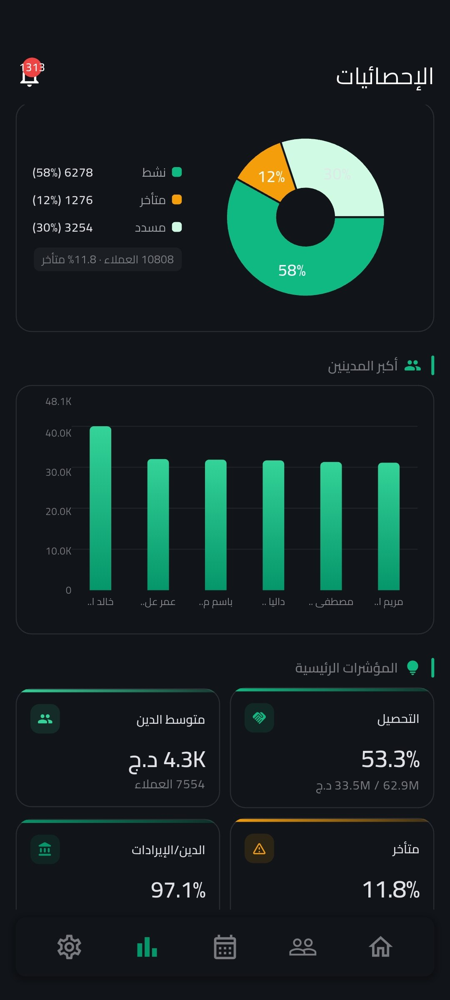</td>
  </tr>
  <tr>
    <td>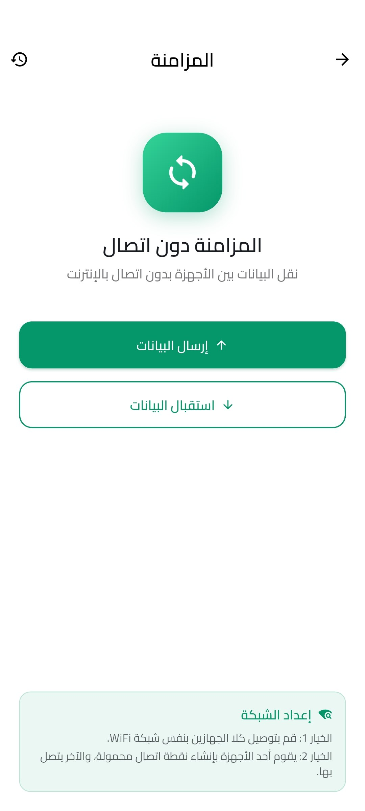</td>
    <td>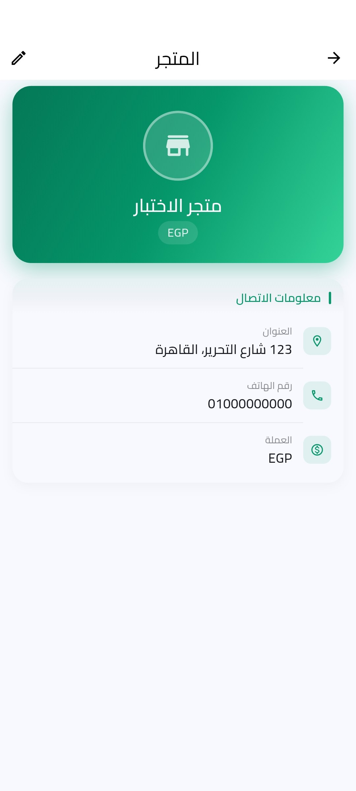</td>
    <td>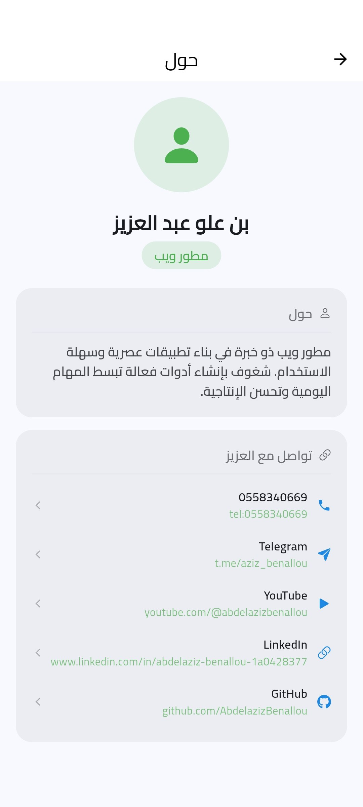</td>
  </tr>
  <tr>
    <td>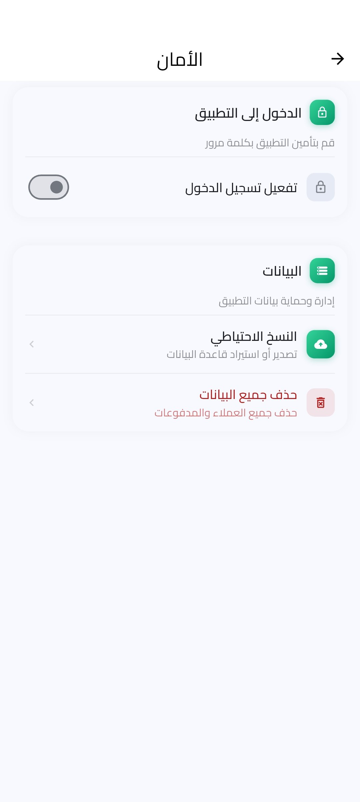</td>
    <td>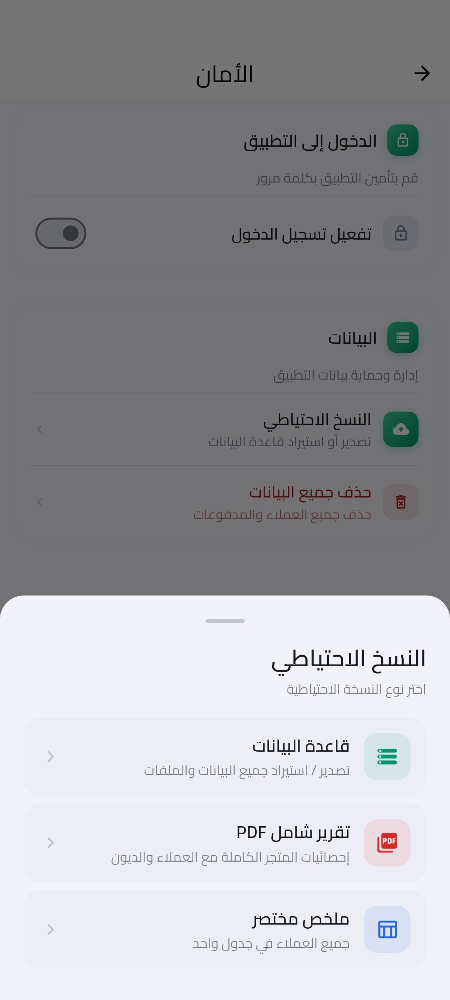</td>
  </tr>
</table>

## Core Features

- Customer management with full profile details.
- Credit and payment tracking for each customer.
- Outstanding debt calculation and payment history.
- Credit limits and due date management.
- Overdue customer detection.
- Daily operations dashboard.
- Store profile management with name, logo, contact details, and social links.
- Calendar page for payment follow-up.
- Local notifications for due and overdue payments.
- Statistics and charts for revenue, debt distribution, top debtors, and customer health.
- PDF export for customer credit history and transaction reports.
- Backup and restore support for the local database.
- Local device-to-device synchronization using QR flow and socket transfer.
- Login protection and security settings.
- Activation and license flow.
- Light, dark, and system theme modes.
- Arabic, French, and English localization.

## Technology Stack

- Flutter for cross-platform mobile UI development.
- Dart as the main programming language.
- SQLite for local offline-first data storage.
- Riverpod for state management in synchronization modules.
- Material Design components with custom themes.
- Native mobile integration for permissions, notifications, file picking, sharing, camera scanning, and external links.

## Main Libraries

| Library | Purpose |
| --- | --- |
| `sqflite` | SQLite database access on mobile |
| `sqflite_common_ffi` | SQLite support for desktop and development environments |
| `path` | Database and file path utilities |
| `shared_preferences` | Local storage for user preferences |
| `flutter_localizations` | App localization support |
| `image_picker` | Customer and store image selection |
| `path_provider` | Access to app storage and temporary directories |
| `url_launcher` | Open phone, web, and social links |
| `font_awesome_flutter` | Social and brand icons |
| `flutter_local_notifications` | Due payment notifications |
| `fl_chart` | Statistics charts and visual reports |
| `pdf` | PDF report generation |
| `share_plus` | Share exported PDF files |
| `timezone` | Notification scheduling support |
| `pointycastle` | Cryptographic operations for licensing and security |
| `asn1lib` | ASN.1 parsing support for cryptographic workflows |
| `device_info_plus` | Device identification for activation and sync |
| `file_picker` | Import backup files |
| `flutter_riverpod` | State management for sync features |
| `qr_flutter` | QR code generation |
| `mobile_scanner` | QR code scanning |
| `crypto` | Hashing and checksum helpers |
| `permission_handler` | Runtime permission handling |

## Data Model

The app uses a local SQLite database with structured tables for:

- Users and login settings.
- Stores and store configuration.
- Customers.
- Credit transactions.
- Payments.
- Late payment reasons.
- Synchronization history.
- Synchronization change logs and metadata.

This makes the application usable offline and suitable for stores that need fast local access without depending on a remote server.

## Project Structure

```text
lib/
  db/                  SQLite helper, tables, and repositories
  l10n/                Arabic, French, and English localization
  logic/               Customer, home, and business calculations
  models/              Application data models
  pages/               Main application screens
  services/            Notifications, PDF export, backup, license, permissions
  sync/                QR, socket, sync providers, and sync history
  theme/               Light and dark themes
  widgets/             Reusable UI components
```

## Requirements

- Flutter SDK installed and configured.
- Dart SDK 3.12.0 or newer, matching the project constraint in `pubspec.yaml`.
- Android Studio or VS Code with Flutter tooling.
- Android SDK for Android builds.
- Xcode for iOS builds on macOS.

## Getting Started

Clone the project and install dependencies:

```bash
flutter pub get
```

Run the app on a connected device or emulator:

```bash
flutter run
```

Build an Android release APK:

```bash
flutter build apk --release
```

Run static analysis:

```bash
flutter analyze
```

## Assets

The project includes custom fonts and image assets:

- Arabic font: Cairo.
- English font: Roboto.
- App images and screenshots under `assets/app`.
- App branding images under `assets/images`.

## Supported Languages

- Arabic.
- French.
- English.

## Developer

Developed by Benallou Abdelaziz.

## License

This repository does not currently include a public license file. Add a license before publishing the project publicly if redistribution or commercial use must be defined.
